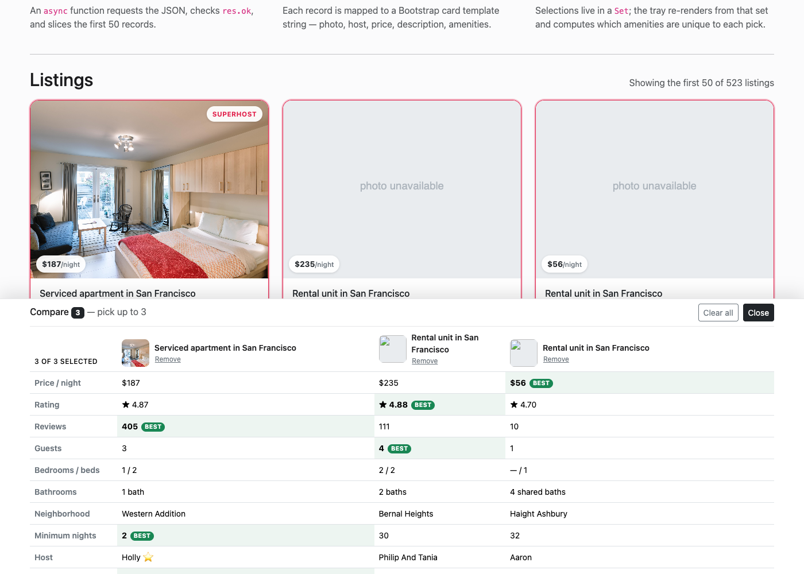

# SF Stays — Airbnb Listings with a Compare Tray

A single-page, no-build web app that loads the first 50 San Francisco Airbnb
listings from a local JSON snapshot using `fetch()` and `await`, renders them as
cards, and lets you pit up to three of them against each other in a compare
tray.

**Live demo:** https://ayushp2207.github.io/WebDev/



## What it does

Each card shows everything the assignment asks for:

| Requirement | Where it comes from |
| --- | --- |
| Listing name | `name`, trimmed at the first `·` so the title isn't a spec dump |
| Description | `description`, with its raw `<br />` markup stripped and clamped to four lines |
| Amenities | `amenities` (a JSON-encoded string) parsed into chips, first five plus a `+N more` count |
| Host name and photo | `host_name` and `host_thumbnail_url`, with a "hosting since" year |
| Price | `price`, parsed from `"$1,234.00"` into a number so it can be compared and sorted |
| Thumbnail | `picture_url`, lazy-loaded in a fixed 4:3 frame |

## The creative addition: a compare tray

Ticking **Compare** on a card (up to three) slides a tray up from the bottom of
the page that lines the picks up field by field:

- **Winner highlighting.** For every numeric row — price, rating, reviews,
  guests, minimum nights, amenity count — the tray works out which listing wins
  and flags that cell. Cheapest wins on price, highest wins on rating, and a tie
  means nobody is flagged, because highlighting two identical cells is just
  noise.
- **An "Only here" row.** This is the part a grid of cards can't do. For each
  selected listing it computes the set difference against the other two and
  shows the amenities *no other pick offers*. Comparing three real listings from
  the dataset, for instance, surfaces that one has a washer/dryer and a patio
  the others lack, while another is the only one with a dedicated workspace and
  free street parking. It answers "what do I actually gain by choosing this
  one?" instead of making you eyeball three chip lists.
- Selections live in a `Set`, which keeps them insertion-ordered, so the tray
  columns always appear in the order you picked them. Once three are selected
  the remaining checkboxes disable themselves rather than silently ignoring
  clicks, and each listing's name in the tray is an anchor that jumps back to
  and highlights its card.

Smaller touches: a stats panel that computes the median price, mean rating, and
superhost count from the loaded data; a superhost ribbon on qualifying cards; an
inline SVG fallback for photos that have expired since the 2023 snapshot
(13 of the 100 images in this slice have); a real error state that explains the
`file://` CORS trap; and `Esc` to dismiss the tray.

## Running it locally

`fetch()` is blocked on `file://` URLs, so the folder has to be served over
HTTP. Opening `index.html` by double-clicking it will show an error card that
says as much.

```bash
git clone https://github.com/ayushp2207/WebDev.git
cd WebDev
npx http-server .          # or: python3 -m http.server 8000
```

Then visit the URL it prints (`http://localhost:8080` or `http://localhost:8000`).

## Deploying

This is a static site with no build step, so GitHub Pages can serve the repo
root directly:

1. Push to GitHub.
2. **Settings → Pages → Build and deployment**.
3. Source: **Deploy from a branch**. Branch: `main`, folder: `/ (root)`.
4. Save and wait a minute for the first build.

The JSON file is ~3 MB, comfortably inside the Pages file-size limit, but it is
the bulk of the page weight — worth knowing if the first load feels slow.

## Project structure

```
.
├── index.html                    # Page shell, nav, hero, stats panel, tray markup
├── css/main.css                  # Card, chip, and tray styling on top of Bootstrap 5.3
├── js/main.js                    # MainModule: fetch, render, and all compare logic
├── airbnb_sf_listings_500.json   # Inside Airbnb snapshot, 523 SF listings
├── docs/screenshot.png           # README image
└── LICENSE                       # MIT
```

`js/main.js` keeps the revealing-module pattern from the in-class demo —
`MainModule()` returns an object exposing `loadData()` and `redraw()`, with
everything else closed over. Notable bits:

- `loadData()` checks `response.ok` and renders a real error state on failure
  instead of leaving a spinner running forever.
- All interpolated data goes through an `escapeHTML()` helper. The data is
  static and local, but building HTML with template strings and dropping raw
  fields in is the exact shape of an injection bug, so it's worth not writing.
- Card checkboxes and tray remove buttons use event delegation, so re-rendering
  the tray never leaves stale listeners behind.
- Image errors don't bubble, so the fallback listener is registered with
  `capture: true`.

## Tech

Vanilla JavaScript (ES2022, no framework, no bundler), Bootstrap 5.3 from a CDN,
and custom CSS. Data from
[Inside Airbnb](https://insideairbnb.com/get-the-data/), San Francisco,
September 2023.

Starter code adapted from John Guerra's in-class demo,
[Airbnb_Listings_demo_page](https://github.com/john-guerra/Airbnb_Listings_demo_page).
Built for CS5610 Web Development at Northeastern. Released under the
[MIT License](LICENSE).
